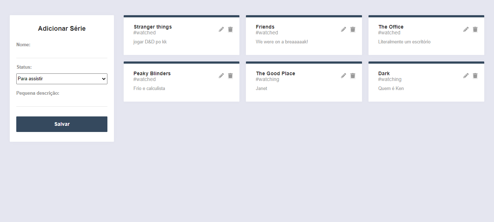

# MySeries

<h3 align="center">
  🎥 Manage your series easily 📽️
</h3>

<p align="center">
   
</p>
  
[](https://github.com/DanielJ06)<space><space>
[](#)

---

# :pushpin: Features
- Add a new serie 🎬
- Delete a serie ✖
- Edit serie status ✏️

---

📥 **Install dependencies**

```yarn install```

---

# 👨‍💻 Technologies
  -⚛️ [ReactJs](https://pt-br.reactjs.org/)
 
  -👾 [NodeJs](https://nodejs.org/en/)
 
  -🎲 [MongoDB Atlas](https://www.mongodb.com/cloud/atlas)
